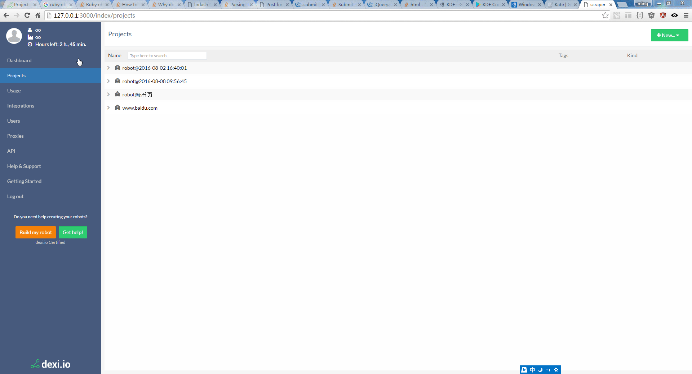

[](https://travis-ci.org/zyedidia/micro)
[](https://goreportcard.com/report/github.com/zyedidia/micro)
[](https://gitter.im/zyedidia/micro?utm_source=badge&utm_medium=badge&utm_campaign=pr-badge&utm_content=badge)
[](https://github.com/zyedidia/micro/blob/master/LICENSE)

**Scraper** is a toy to extract web data just by mouse.

* All css styles and layouts come from [https://dexi.io](http://dexi.io).
* All images including logo comes from  [https://dexi.io](http://dexi.io).
* All functions come from  [https://dexi.io](http://dexi.io). but are self-implemented.

Dexi.io provides such amazing tool, so I just want to make a little copy from it.

Here is a gif to show the little toy how to work.



To see more screenshots of micro, showcasing all of the default colorschemes, see [here](http://zbyedidia.webfactional.com/micro/screenshots.html).

# Features

* Not need coding, but need web concepts include html,xpath.
* using Xpath selector , but dexi.io using CSS selector.
* using phantomjs engine at backend

# Installation

To install scraper, you can download a [prebuilt binary](https://github.com/zyedidia/micro/releases), or you can build it from source.

If you want more information about ways to install micro, see this [wiki page](https://github.com/zyedidia/micro/wiki/Installing-Micro)

### Prebuilt binaries

All you need to install micro is one file, the binary itself. It's as simple as that!

Download the binary from the [releases](https://github.com/zyedidia/micro/releases) page.

On that page you'll see the nightly release, which contains binaries for micro which are built every night,
and you'll see all the stable releases with the corresponding binaries.

If you'd like to see more information after installing micro, run `micro -version`.

### Building from source

If your operating system does not have binary, but does run Go, you can build from source.

Make sure that you have Go version 1.5 or greater (Go 1.4 will work if your version supports CGO).

```sh
go get -u github.com/zyedidia/micro/...
```

### Linux clipboard support

On Linux, clipboard support requires 'xclip' or 'xsel' command to be installed.

For Ubuntu:

```sh
sudo apt-get install xclip
```

If you don't have xclip or xsel, micro will use an internal clipboard for copy and paste, but it won't work with external applications.

### Colors and syntax highlighting

If you open micro and it doesn't seem like syntax highlighting is working, this is probably because
you are using a terminal which does not support 256 color. Try changing the colorscheme to `simple`
by running `> set colorscheme simple`.

If you are using the default ubuntu terminal, to enable 256 make sure your `TERM` variable is set
to `xterm-256color`.

Many of the Windows terminals don't support more than 16 colors, which means
that micro's default colorscheme won't look very good. You can either set
the colorscheme to `simple`, or download a better terminal emulator, like
mintty.

### Plan9, NaCl, Cygwin

Please note that micro uses the amazing [tcell library](https://github.com/gdamore/tcell), but this
means that micro is restricted to the platforms tcell supports. As a result, micro does not support
Plan9, NaCl, and Cygwin (although this may change in the future).

# Usage

Once you have built the editor, simply start it by running `micro path/to/file.txt` or simply `micro` to open an empty buffer.

Micro also supports creating buffers from `stdin`:

```sh
ifconfig | micro
```

You can move the cursor around with the arrow keys and mouse.

You can also use the mouse to manipulate the text. Simply clicking and dragging
will select text. You can also double click to enable word selection, and triple
click to enable line selection.

# Documentation and Help

Micro has a built-in help system which you can access by pressing `CtrlE` and typing `help`. Additionally, you can
view the help files online [here](https://github.com/zyedidia/micro/tree/master/runtime/help).

I also recommend reading the [tutorial](https://github.com/zyedidia/micro/tree/master/runtime/help/tutorial.md) for
a brief introduction to the more powerful configuration features micro offers.

# Contributing

If you find any bugs, please report them! I am also happy to accept pull requests from anyone.

You can use the Github issue tracker to report bugs, ask questions, or suggest new features.