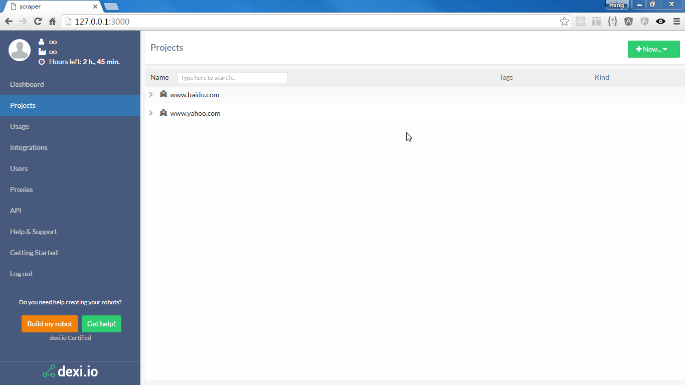

[](https://github.com/zyedidia/micro/blob/master/LICENSE)

**Scraper** is a toy to extract web data just by mouse.

* All css styles and layouts come from [https://dexi.io](http://dexi.io).
* All images including logo comes from  [https://dexi.io](http://dexi.io).
* All functions come from  [https://dexi.io](http://dexi.io). but are self-implemented.

Dexi.io provides such amazing tool, so I just want to make a little copy from it.

Here is a gif to show the little toy how to work.



To see more gif of Scraper, see [show1](./app/assets/images/scraper_show1.gif) and [show2](./app/assets/images/scraper_yahoo.gif).

# Features

* Not need coding, but need web concepts include html,XPath.
* using XPath selector , but dexi.io using CSS selector.
* using phantomjs engine at backend

# Installation

To install scraper, you should install [rails](http://installrails.com/) and download [phantomjs](http://phantomjs.org/).

### After install rails.

For Centos ,Mac and Windows, you should update scraper project

```sh
cd <scraper root>
bundle update
```

then all dependencies will be installed.

For Mac, installing nokogiri gem may have some problem, but keep some patience.

If you cannot link http://rubygems.org or https://rubygems.org, you had better use proxy to update.


# Start scraper

Once you have built the editor, simply start it by running `micro path/to/file.txt` or simply `micro` to open an empty buffer.

Micro also supports creating buffers from `stdin`:

```sh
cd <scraper root>
rails server 
```

then server will start successfully like this below.

```
[ym@centos7 scraper]$ rails server
=> Booting WEBrick
=> Rails 4.2.6 application starting in development on http://localhost:3000
=> Run `rails server -h` for more startup options
=> Ctrl-C to shutdown server
[2016-11-03 17:59:46] INFO  WEBrick 1.3.1
[2016-11-03 17:59:46] INFO  ruby 2.2.1 (2015-02-26) [x86_64-linux]
[2016-11-03 17:59:46] INFO  WEBrick::HTTPServer#start: pid=4052 port=3000
```

Then you can open chrome browser(**not support IE or Firefox or Safari**), and open http://127.0.0.1:3000. 


# Only support Chrome browser

You know scraper is a toy, so I just develop it using my favorite browser.

# Documentation and Help

If you don't know how to play this little toy, you can search some document for [dexi.io](http://dexi.io).

# Contributing

This project is just a little toy, so it has much more bugs. If you find them ,please let me know.